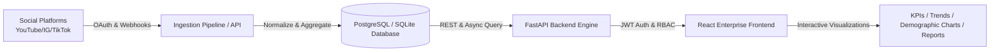

# CreatorIQ Enterprise Analytics Dashboard: Architecture & Objectives Specification

## 1. Project Objectives & Analytics Workflows (Task i)

### 1.1 Core Objectives
- **Multi-Platform Creator Intelligence**: Aggregate real-time and historical analytics across YouTube, Instagram, TikTok, Twitter/X, and LinkedIn into a single unified source of truth.
- **Cross-Persona Decision Support**:
  - **Creators**: Track performance velocity, engagement benchmarks, viewer retention, and multi-stream revenue attribution.
  - **Agencies**: Manage multi-creator talent rosters, track portfolio benchmarks, and generate one-click branded PDF/CSV reports.
  - **Marketing & Brand Teams**: Monitor influencer marketing campaigns, evaluate creator ROI, and benchmark CPM/CPE metrics.
  - **System Administrators**: Audit security logs, monitor data ingestion pipelines, and manage organization-wide RBAC.
- **Actionable Revenue & Growth Forecasting**: Predict future subscriber/follower milestones and forecast multi-channel revenue streams (Sponsorships, AdSense, Affiliates, Merch) using predictive growth models.

### 1.2 End-to-End Analytics Workflows


1. **Ingestion & Synchronization**:
   - Creator links accounts via OAuth 2.0.
   - Sync service ingests video/post metadata, view counts, watch time, shares, and engagement rates.
2. **Aggregation & Normalization**:
   - Metrics normalized across disparate platform APIs (e.g., YouTube Views vs TikTok Plays vs IG Impressions).
3. **Analytics Serving**:
   - FastAPI provides cached aggregation endpoints (`/api/v1/analytics/overview`, `/api/v1/analytics/growth`, `/api/v1/analytics/revenue`).
4. **Interactive Dashboard Exploration**:
   - React UI provides dynamic filters (time ranges, platforms, content formats) and instant data export (CSV/JSON/PDF).

---

## 2. Dashboard Architecture & Database Schema (Task ii)

### 2.1 System Architecture
- **Frontend Layer**: React 18, Vite 6, Tailwind CSS v4, Lucide React, Recharts visualization library.
- **Backend API Layer**: FastAPI (Python 3.14/uv), Pydantic v2 data models, JWT authentication, CORS middleware.
- **Database Layer**: Relational Schema (compatible with PostgreSQL/Supabase & SQLite), indexing on `user_id`, `platform`, and `published_at`.

### 2.2 Database Schema Specification
```sql
-- 1. Profiles & RBAC
CREATE TABLE profiles (
    id UUID PRIMARY KEY,
    email VARCHAR(255) UNIQUE NOT NULL,
    full_name VARCHAR(255),
    avatar_url TEXT,
    role VARCHAR(50) CHECK (role IN ('creator', 'agency', 'marketing_team', 'admin')) NOT NULL DEFAULT 'creator',
    is_active BOOLEAN DEFAULT TRUE,
    created_at TIMESTAMP WITH TIME ZONE DEFAULT CURRENT_TIMESTAMP,
    updated_at TIMESTAMP WITH TIME ZONE DEFAULT CURRENT_TIMESTAMP
);

-- 2. Connected Platform Accounts
CREATE TABLE connected_accounts (
    id UUID PRIMARY KEY,
    user_id UUID REFERENCES profiles(id) ON DELETE CASCADE,
    platform VARCHAR(50) NOT NULL, -- 'YouTube', 'Instagram', 'TikTok', etc.
    platform_user_id VARCHAR(255),
    username VARCHAR(255) NOT NULL,
    access_token TEXT,
    refresh_token TEXT,
    followers_count BIGINT DEFAULT 0,
    is_connected BOOLEAN DEFAULT TRUE,
    last_synced_at TIMESTAMP WITH TIME ZONE,
    created_at TIMESTAMP WITH TIME ZONE DEFAULT CURRENT_TIMESTAMP,
    updated_at TIMESTAMP WITH TIME ZONE DEFAULT CURRENT_TIMESTAMP
);

-- 3. Content Items & Metrics
CREATE TABLE content_items (
    id UUID PRIMARY KEY,
    user_id UUID REFERENCES profiles(id) ON DELETE CASCADE,
    platform VARCHAR(50) NOT NULL,
    platform_content_id VARCHAR(255),
    title VARCHAR(500) NOT NULL,
    content_type VARCHAR(50) NOT NULL, -- 'Video', 'Short', 'Post', 'Reel'
    url TEXT,
    thumbnail_url TEXT,
    views_count BIGINT DEFAULT 0,
    likes_count BIGINT DEFAULT 0,
    comments_count BIGINT DEFAULT 0,
    shares_count BIGINT DEFAULT 0,
    engagement_rate NUMERIC(5,2) DEFAULT 0.00,
    published_at TIMESTAMP WITH TIME ZONE NOT NULL,
    created_at TIMESTAMP WITH TIME ZONE DEFAULT CURRENT_TIMESTAMP,
    updated_at TIMESTAMP WITH TIME ZONE DEFAULT CURRENT_TIMESTAMP
);

-- 4. Revenue Transactions
CREATE TABLE revenue_records (
    id UUID PRIMARY KEY,
    user_id UUID REFERENCES profiles(id) ON DELETE CASCADE,
    source VARCHAR(50) NOT NULL, -- 'sponsorship', 'adsense', 'affiliate', 'merchandise'
    amount NUMERIC(10,2) NOT NULL,
    currency VARCHAR(10) DEFAULT 'USD',
    period_date DATE NOT NULL,
    status VARCHAR(50) DEFAULT 'completed',
    created_at TIMESTAMP WITH TIME ZONE DEFAULT CURRENT_TIMESTAMP
);
```

---

## 3. UI Wireframes & Dashboard Workflow Planning (Task iii)

### 3.1 Wireframe Layout Structure
```
+-------------------------------------------------------------------------------+
| TOP BAR: [Logo: CreatorIQ]  [Search Box]      [Notifications (3)] [User Avatar]|
+-------------------+-----------------------------------------------------------+
| SIDEBAR           | BREADCRUMB: Dashboard > Creator Analytics                 |
| - Overview        | [Time Range: 30D v] [Platform: All v]  [Export CSV/PDF v] |
| - Content         +-----------------------------------------------------------+
| - Audience        | KPI CARDS:                                                |
| - Revenue         | [ Total Views ] [ Engagement ] [ Est. Revenue ] [ Followers]
| - Growth          | [ 4.2M (+12%) ] [ 5.8% (+0.4%) ] [ $14,280 (+8%) ] [ 184K ]
| - Connections     +-----------------------------+-----------------------------+
| - Reports         | MAIN CHART: Performance     | DONUT: Platform Share       |
| - Notifications   | (Views / Impressions Trend) | (YouTube, IG, TikTok, X)    |
| - Settings        +-----------------------------+-----------------------------+
| - Portals Switch  | RECENT CONTENT TABLE        | REVENUE STREAMS             |
|   (Agency/Brand)  | Title | Platform | Views | ER| Sponsorships vs AdSense     |
+-------------------+-----------------------------+-----------------------------+
```

### 3.2 Role-Based Access Control (RBAC) Matrix
| Module / Capability | Creator | Agency Manager | Brand / Marketing | Admin |
| :--- | :---: | :---: | :---: | :---: |
| Personal Analytics & KPIs | ✅ Full | ✅ Full | ✅ Read | ✅ Full |
| Multi-Creator Roster View | ❌ | ✅ Full | ✅ Roster | ✅ Full |
| Campaign ROI & Budgeting | ❌ | ✅ Read | ✅ Full | ✅ Full |
| Platform OAuth Connect | ✅ Full | ✅ Manage | ❌ | ✅ Full |
| System Audit & User Mgmt | ❌ | ❌ | ❌ | ✅ Full |
